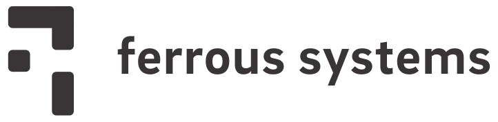

# A Love Story

## Or

## Writing safe and efficient communication protocols with Embedded Rust


<!--
    *****************************************
    Introduction
    *****************************************
-->

# James Munns

[`@bitshiftmask`](https://twitter.com/bitshiftmask)

[james.munns@ferrous-systems.com](mailto:james.munns@ferrous-systems.com)

Meeting Embedded

2019-11-13

::: notes

:::

## what do i do?

* core team: rust embedded working group
* managing director at [ferrous systems](https://ferrous-systems.com)
* embedded systems!
  * robotics
  * safety critical consulting
  * avionics
  * gas detection
  * internet of things

----

* used to be a lot of `c`
* then a little more `python`
* nowadays mostly `rust` with a little `c`
* (i've never been good at `c++`)

## put more shortly

make embedded systems talk to other systems

---

* sensors and actuators
* other embedded systems
* bigger embedded systems
* nearby pcs
* servers, phones, or pcs over the internet

<!--
    *****************************************
    Problem Statement
    *****************************************
-->

# communication is easy!

::: notes
* We live in a digital world! Everything is just bits and bytes
* To send messages we just pick up the bytes over here, and we put them over there!
* just hit the data with a memcpy, and off to lunch we go
:::

## communication ~~is easy~~ deceptively hard.

# what's the problem?

c data types are not a good message format

::: notes
* Getting started is easy, getting it right is hard
* Lots of details to get wrong
* Errors are subtle, but can have a big impact
:::


## dissimilar devices

## `int`

## what is an int?

```c
typedef struct {
    unsigned short int adc_id;
    unsigned int       adc_counts;
    int                millivolts;
} AdcReading;
```

## It depends.

## `enum`

## How big is this enum?

```c
typedef enum {
    ADC_IDX_TEMPERATURE, // 0
    ADC_IDX_HUMIDITY,    // 1
    ADC_IDX_COUNT,       // 2
} AdcIdx;
```

## It's an `int`!

```c
_Static_assert(sizeof(AdcIdx) == sizeof(int), ":)");
```

## But `int` isn't portable

## also, `-fshort-enums`

```c
// compiled with -fshort-enums
typedef enum {
    ADC_IDX_TEMPERATURE, // 0
    ADC_IDX_HUMIDITY,    // 1
    ADC_IDX_COUNT,       // 2
} AdcIdx;
_Static_assert(1==sizeof(AdcIdx), ":/");
```

## which can then change subtly

```c
// compiled with -fshort-enums
typedef enum {
    ADC_IDX_TEMPERATURE, // 0
    ADC_IDX_HUMIDITY,    // 1
    // ....
    ADC_IDX_AMPERAGE,    // 255
    ADC_IDX_COUNT,       // 256
} AdcIdx;
_Static_assert(2==sizeof(AdcIdx), ":(");
```

## Defaults are different

* ISO C: `sizeof(int)`
* ISO C++: "big enough"
* IAR EWARM for C/C++: "big enough"

## `struct`

## padding

```c
typedef struct {
    uint8_t  adc_id;
    uint32_t adc_counts;
    int32_t  millivolts;
} AdcReading;
```

## 8-bit machine - padding

```c
typedef struct {
    uint8_t  adc_id;
    uint32_t adc_counts;
    int32_t  millivolts;
} AdcReading;
_Static_assert(9 == sizeof(AdcReading), ":)");
```

## 32-bit machine - padding

```c
typedef struct {
    uint8_t  adc_id;
    // uint8_t padding[3];
    uint32_t adc_counts;
    int32_t  millivolts;
} AdcReading;
_Static_assert(12 == sizeof(AdcReading), ":)");
```

## `__attribute__((packed))`

```c
typedef struct {
    uint8_t  adc_id;
    uint32_t adc_counts;
    int32_t  millivolts;
} __attribute__((packed)) AdcReading;
_Static_assert(9 == sizeof(AdcReading), ":)");
```

## performance

```c
AdcReading demo[10] = { 0 };

for(int i = 0; i <= 10; i++) {
    demo[i].adc_id     = i;
    // unaligned access
    demo[i].adc_counts = get_adc_counts(i);
    demo[i].millivolts = demo.adc_counts * SCALING_FACTOR;
}
```

## alignment

some devices (arm) don't allow unaligned access at all

## when can problems happen?

## sending

```c
uint8_t tx_buffer[sizeof(Message)];
memcpy(tx_buffer, &message, sizeof(tx_buffer));
send(tx_buffer, sizeof(tx_buffer));
```

## looks good!

## Receiving

```c
uint8_t rx_buffer[sizeof(Message)];
recv(rx_buffer, sizeof(rx_buffer));
Message* msg = (Message*)rx_buffer;
```

## looks good!

## do something

```c
void process_counts(uint32_t* counts) {
    uint32_t last_count = *counts;
    // ...
    return;
}
```

## uh oh...

```c
uint8_t rx_buffer[sizeof(Message)];
recv(rx_buffer, sizeof(rx_buffer));
Message* msg = (Message*)rx_buffer;
// uh oh
process_counts(&msg->adc_counts);
```

## oops

## endianess

```c
AdcReading data = {
    .adc_id     = 0x12,
    .adc_counts = 0xA1A2B3B4,
    .millivolts = -4300,
};
// Little Endian
//    [0x12][0x??][0x??][0x??]
//    [0xB4][0xB3][0xA2][0xA1]
//    [0x34][0xEF][0xFF][0xFF]
// Big Endian
//    [0x??][0x??][0x??][0x12]
//    [0xA1][0xA2][0xB3][0xB4]
//    [0xFF][0xFF][0xEF][0x34]
```

# why not...

## JSON

## protobufs (nanopb)

## resources are expensive

* code size
* cpu time
* memory usage
* size on the wire

# I'm here to talk about Rust

## Rust is:

* a compiled systems language
* based on llvm
* ships a stable release every 6 weeks
* supports hosted and bare metal environments

## Rust history

* 2006: started
* 2009: official mozilla project
* 2015: 1.0
* 2018: second edition
* 2018: stable bare metal support

## Used by

* amazon
* facebook
* microsoft
* google
* mozilla
* cloudflare

## mission critical software

## why rust?

* modern tooling
* cross compilation
* non-optional static analysis
* first class documentation
* convenience without comprimise
* features like iterators, generics, hygenic macros...

## A language that has learned

take the best concepts from the last 30 years

evolutionary rather than revolutionary

## Correctness

* memory safety
* strong types
* information drives optimization
* move correctness from runtime to compile time

## Modern Tooling

* build system
* package manager
* documentation generation tool
* testing framework
* extensible, but sane defaults

## Efficient and Correct code doesn't have to be painful

## And it shouldn't require wizardry

## Easy for users to get right the first time

# I'm here to talk about serde

## Serialization and Deserialization

## Splits the work in two parts

## Frontend

> ("the data")

```rust
struct AdcReading {
    adc_id: u8,
    adc_counts: u32,
    millivolts: i32,
}
```

## Backend

> ("the format")

* json
* yaml
* toml
* CBOR
* Pickle (python)
* assorted binary formats

## Traits

* like interfaces in C++
* `Serialize` (frontend)
* `Serializer` (backend)
* `Deserialize` (frontend)
* `Deserializer` (backend)

## serde data model

* primatives (`u8`/`i32`/`f64`/`bool`)
* arrays
* structs
* maps
* enums
* 29 items in total

## Derive

```rust
#[derive(Serialize, Deserialize)]
struct AdcReading {
    adc_id: u8,
    adc_counts: u32,
    millivolts: i32,
}
```

## and serialize!

```rust
let reading = AdcReading {
    adc_id: 0,
    adc_counts: 0x1234_4567,
    millivolts: -1_000,
};

let _ = serde_json::to_string(&reading);
let _ = serde_yaml::to_string(&reading);
```

## works great in bare metal

```rust
let reading = AdcReading {
    adc_id: 0,
    adc_counts: 0x1234_4567,
    millivolts: -1_000,
};

let mut buffer = [0u8; 128];
let _ = ssmarshal::serialize(&mut buffer, &reading);
let _ = postcard::to_slice(&reading, &mut buffer);
```

# But what about C?

## Rust supports C FFI

## Note on structure layout

```rust
struct AdcReading {
    adc_id: u8,
    adc_counts: u32,
    millivolts: i32,
}
```

## But we can make it work

```rust
#[repr(C)]
struct AdcReading {
    adc_id: u8,
    adc_counts: u32,
    millivolts: i32,
}
```

## Functions too!

## In Rust

```rust
// from `ssmarshal`
pub fn serialize<T: Serialize>(
    buf: &mut [u8],
    val: &T
) -> Result<usize, Error>
{
    /* ... */
}
```

## Couple problems

* c doesn't have slices
    * pointer + max length
* c doesn't have generics
    * we can monomorphize
* c doesn't have result types
    * we can use flags

## In Rust (C compatible)

```rust
#[no_mangle]
pub extern "C" fn serialize_AdcReading(
    input: *const AdcReading,
    output_buf: *mut u8,
    output_buf_max_sz: usize,
    output_buf_used: *mut usize,
) -> bool {
    /* ... */
}
```

## Put it together - Rust

```rust
#[repr(C)]
struct AdcReading {
    adc_id: u8,
    adc_counts: u32,
    millivolts: i32,
}

#[no_mangle]
pub extern "C" fn serialize_AdcReading(
    input: *const AdcReading,
    output_buf: *mut u8,
    output_buf_max_sz: usize,
    output_buf_used: *mut usize,
) -> bool { /* ... */ }
```

## fight with tools

## `cbindgen`

Converts Rust FFI code to C headers

## Rust Data Becomes...

```rust
#[derive(Serialize, Deserialize)]
#[repr(C)]
struct AdcReading {
    adc_id: u8,
    adc_counts: u32,
    millivolts: i32,
}
```

## C Data

```c
typedef struct {
    uint8_t  adc_id;
    uint32_t adc_counts;
    uint32_t millivolts;
} AdcReading;
```

## Rust Functions Become...

```rust
#[no_mangle]
pub extern "C" fn serialize_AdcReading(
    input: *const AdcReading,
    output_buf: *mut u8,
    output_buf_max_sz: usize,
    output_buf_used: *mut usize,
) -> bool { /* ... */ }
```

## C functions

```c
bool serialize_AdcReading_t(
    const AdcReading_t *input,
          uint8_t      *output_buf,
          uintptr_t     output_buf_max_sz,
          uintptr_t    *output_buf_used
);
```

## These might be different structs!

```c
typedef struct {
    uint8_t  adc_id;
    uint32_t adc_counts;
    uint32_t millivolts;
} AdcReading;
```

## But that's okay!

we always serialize and deserialize the data on the wire

local representation doesn't matter

## Linking it together

rust can make staticlibs (`.a`)

or dynamic libraries (`.so` or similar)

or both!

## Before

```toml
[package]
name = "serializer"

[dependencies.serde]
version = "1.0"
default-features = false
features = ["derive"]

[dependencies.ssmarshal]
version = "1.0"
default-features = false
```

## After

```toml
[package]
name = "serializer"

[lib]
crate-type = ["staticlib", "dylib"]

[dependencies.serde]
version = "1.0"
default-features = false
features = ["derive"]

[dependencies.ssmarshal]
version = "1.0"
default-features = false
```

## In your build system

* run `cargo build --release`
* run `cbindgen`
* include the generated header file
* link in the library

## In case you need to go the other way

## `bindgen`

turn C header files into Rust data/function declarations

# Why Rust, Why Serde, Why My Project?

## Rust has competitive advantages

## Changing tools isn't free

## Rewrites are dangerous

## Find incremental successes

## Messaging is usually well contained

## Bite sized task

## Lends well to tooling

#



[ferrous-systems.com](https://ferrous-systems.com)

# Embedded Rust and Serde

> A Love Story

James Munns

@bitshiftmask

james.munns@ferrous-systems.com

https://github.com/ferrous-systems/embedded-rust-and-serde
